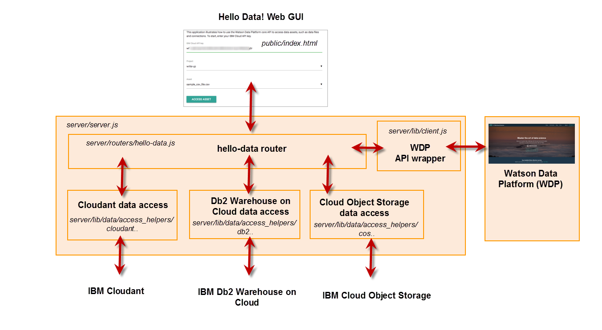

***
 TODO: 
  * replace all stage1 URLs with public URLs 
  * starter kit home page (currently points to stage1)
  * add link to auth token topic
***

# About the Hello Data! application

The Starter Kit application illustrates how to navigate the project and asset structure, collect data asset information and then shows how to use that information to access a NoSQL database (IBM Cloudant), a relational database (Db2 Warehouse on Cloud) and a data file stored on the Cloud (IBM Cloud Object Storage.)

It comprises of two components:
 * A simple HTML/Javascript web UI that collects user input and communicates with the back-end.
 * A [Express web framework for Node.js](http://expressjs.com/) -based back-end. The back-end leverages an unofficial purpose-build shallow warpper library to communicate with the Watson Data Platform API and three sample data source implementations for IBM Cloudant, IBM Db2 Warehouse on Cloud and IBM Cloud Object Storage.



## Implementation overview

**Note**: Throughout this document you will find references to source code files, such as `/server/lib/client.js`. The specified location is relative to the directory where you extracted the downloaded source code or the github repository into which the starter code was pushed by the devops pipeline.

### Hello Data! back-end 

To keep things simple, the back-end (`/server/routers/hello-data.js`) provides three state-less endpoints for the web UI:
 * list Watson Data Platform projects
 * list Watson Data Platform project assets
 * access Watson Data Platform data assets

Each endpoint invokes one or more Watson Data Platform API endpoints using the wrapper library.

### Shallow Watson Data Platform API Wrapper
The Watson Data Platform provides a [REST API](https://developer.ibm.com/api/view/id-1084:title-Watson_Data_Platform_Core_Services) that applications can use consume its services. 
 > Note: The API base URL is `https://api.dataplatform.ibm.com`.

This application utilizes an unofficial shallow wrapper library (`/server/lib/client.js`), which encapsulates the HTTP request/response processing (including authentication).
 > Note: This purpose-built library is limited in scope and was only created to simplify the code containing the Hello Data! business logic.

#### Accessing the Watson Data Platform API 

(TODO links)
Each API endpoint call requires an API token, which you mint by calling an authorization endpoint, providing your IBM Cloud API key. API tokens expire after 3600 seconds.

 > Note: At the time of writing the authentication API returns HTTP status code `400 (Bad Request)` and not `403 (Forbidden)` if an invalid API key was provided.
 
Watson Data Platform API endpoints return only information that is accessible to the specified API key. Follow [this link](https://wdp-api-registry.mybluemix.net/api-explorer/) to access the Swagger specification.

#### Listing Watson Data Platform projects

To list projects, call the `GET /v2/projects` endpoint. The JSON response contains for each project two pieces of key information: the project name (`entity.name`) and a unique internal project id (`metadata.guid`). Most API endpoints that operate in the context of a project (such as the project API or the asset API) require this project id as an input. Like all other list-ing endpoints, the project list endpoint supports pagination and filtering. 

> For illustrative purposes, the Hello Data! web UI displays the raw JSON response.

#### Listing Watson Data Platform project assets 

To retrieve a project's asset list, call the `POST /v2/asset_types/asset/search` endpoint, passing the project id as parameter. The JSON request body must contain the following content

```
 { 
   "query": "*:*"
 }
```

The JSON response contains asset metadata, such as the asset name (`metadata.name`), asset type (`metadata.asset_type`) and unique asset id (`metadata.asset_id`). Call the appropriate asset type specific API endpoints (see next section) with the desired asset id to collect the information needed to access the data asset.

> For illustrative purposes, the Hello Data! web UI displays the raw JSON response for the API token the user entered.

#### Accessing Watson Data Platform data assets 

Projects can contain data assets, such as data source connections (`metadata.asset_type` equals `connection`), files or tables (`metadata.asset_type` is for both `data_asset`). The asset list response includes general asset information but does not include the metadata required to access those assets (e.g. with the intend to access a relational database or download a csv file.) 

The `/v2/assets` API provides endpoints that allow for the creation, retrieval, update and deletion of data assets.

> You can use this API to manage assets in projects and catalogs.

Use the `/v2/connections` API endpoints to create, retrieve, update, delete connections or discovery of assets in the data source that a connection points to.

> You can use the connections API to manage connection assets in projects and catalogs.

### IBM Cloudant data access

Access to Cloudant is implemented in `/server/lib/data_access_helpers/cloudant_data_access_sample.js`. The sample code leverages the official [cloudant](https://www.npmjs.com/package/cloudant) library but you have [a couple of alternatives](https://medium.com/ibm-watson-data-lab/choosing-a-cloudant-library-d14c06f3d714), depending on your exact needs. The code uses the data assets' connection credentials to connect to the Cloudant service instance and counts the number of databases in that instance.

### IBM Db2 Warehouse on Cloud data access

Access to IBM Db2 Warehouse on Cloud is implemented in `/server/lib/data_access_helpers/db2wh_data_access_sample.js`. The sample code uses the official [ibm_db](https://www.npmjs.com/package/ibm_db) library. The code uses the data assets' connection credentials to connect to the  instance and counts the number of user tables.

### IBM Cloud Object storage data access

Access to IBM Cloud Object Storage is implemented in `/server/lib/data_access_helpers/cos_data_access_sample.js`. The sample code uses the official [ibm-cos-sdk](https://www.npmjs.com/package/ibm-cos-sdk) library. The code uses the data assets' resource information to download  the content and determine its size.


## Running the application
To deploy and run this Watson Data Platform Starter Kit follow the instructions on the [Watson Data Platform Starter Kit page](https://console.stage1.bluemix.net/developer/dataplatform/starter-kits).

The Starter Kit and its instructions will help you set up a Watson Data Platform project if you do not have one, configure instances of Cloudant and Db2 Warehouse on Cloud and run the Node.js application either in the IBM Cloud with continuous delivery enabled or locally on your workstation. 

### Debugging 
After the application has been deployed to your target environment you can optionally enable debugging to learn more about the interactions between the modules and the [Watson Data Platform API](https://wdp-api-registry.mybluemix.net/api-explorer/) and the data services.
 * Hello Data! web page: debug output is always written to the browser console.
 * Back-end modules: to enable debug output for all modules set environment variable `DEBUG` to `hello-data:*`
   * hello-data router: to enable debug output only for this module set environment variable `DEBUG` to `hello-data:router`
   * hello-data Cloudant data access: to enable debug output only for this module set environment variable `DEBUG` to `hello-data:cloudant_sample`
   * hello-data Db2 Warehouse on Cloud data access: to enable debug output only for this module set environment variable `DEBUG` to `hello-data:db2wh_sample`
   * hello-data IBM Cloud Object Storage data access: to enable debug output only for this module set environment variable `DEBUG` to `hello-data:cos_sample`
