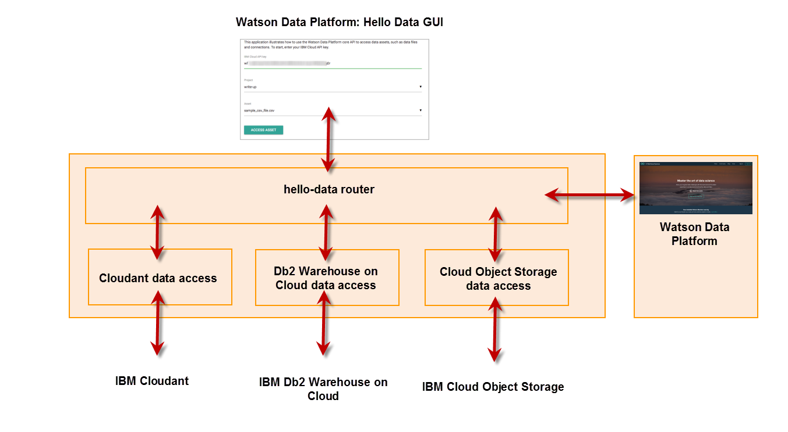

# Hello Data!

As a developer using the Watson Data Platform you will frequently interacting with team members using Data Science Experience, Data Catalog and Data Refinery user experiences. You may be referencing projects, catalogs and assets those people are working with.

This starter kit application illustrates how to discover and interact with project data sources using the [Watson Data Platform Core API](https://wdp-api-registry.mybluemix.net/api-explorer/). 

The application uses node.js to navigate the project and asset structure, collect data asset information and then shows how to use that information to access a Cloudant database, a DB2 Warehouse on Cloud database and a data file that's stored in IBM Cloud Object Storage.

## Deployment
To deploy this Watson Data Platform Starter Kit follow the instructions on [the Watson Data Platform Starter Kit page](https://dev-console.stage1.bluemix.net/developer/dataplatform/starter-kits)

The Starter Kit and its instuctions will help you set up a Watson Data Platform project if you do not have one, configure instances of Cloudant and DB2 Warehouse on Cloud and run the node.js application either in the IBM cloud with continuous delivery enabled or locally on your workstation. 

### Debugging 
After the application has been deployed to yor target environment you can optionally enable debugging to learn more about the interactions between the modules and the [Watson Data Platform API](https://wdp-api-registry.mybluemix.net/api-explorer/) and the data services.
 * Hello Data web page: debug output is always written to the browser console.
 * Backend modules: to enable debug output for all modules set environment variable `DEBUG` to `hello-data:*`
   * hello-data router: to enable debug output only for this module set environment variable `DEBUG` to `hello-data:router`
   * hello-data Cloudant data access: to enable debug output only for this module set environment variable `DEBUG` to `hello-data:cloudant_sample`
   * hello-data Db2 Warehouse on Cloud data access: to enable debug output only for this module set environment variable `DEBUG` to `hello-data:db2wh_sample`
   * hello-data IBM Cloud Object Storage data access: to enable debug output only for this module set environment variable `DEBUG` to `hello-data:cos_sample`
